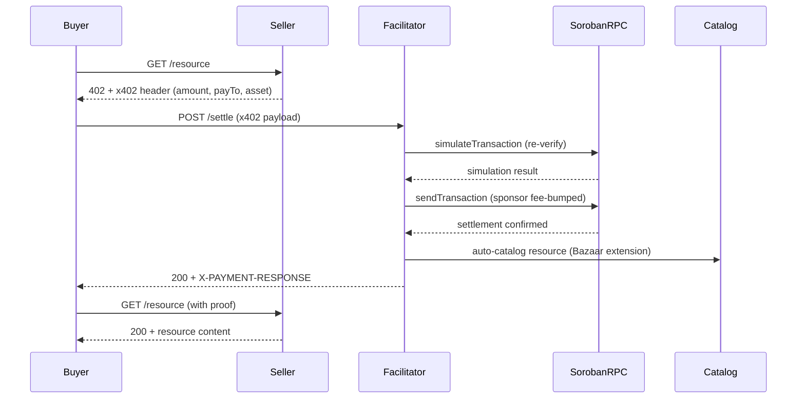
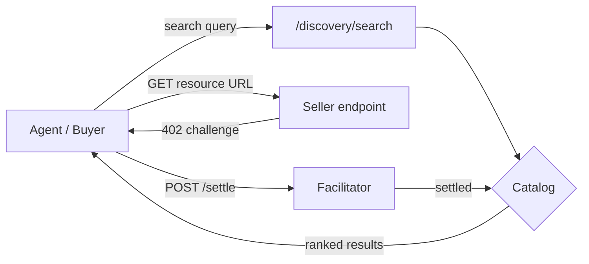

# Vellar Facilitator — Technical Document

SCF #46 RFP Track submission — "X402 Facilitator with Bazaar (Discovery)
Support." This document governs this repo (`vellar-facilitator`).

**Status: live on Stellar testnet and mainnet (stellar:pubnet), 731 tests
passing (4 skipped). Production-hardened — the channel pool (50 accounts;
50/50 under load), telemetry (11 Prometheus metrics), the deploy runbook, and
the RFP gap fixes are all shipped. Pre-mainnet checklist: pubnet deployment is
now done (§9); the external security audit remains, and semantic search is
shipped but not yet claimed as met — see the checklist at the top of §9.**
The facilitator, Bazaar discovery, the MCP server, and the trust layer are
implemented, tested, and deployed at `https://vellar-facilitator.onrender.com`,
with on-chain settlements to show for it on both networks (§7). The
pre-mainnet security review is complete with every finding tracked to closure
(`docs/security-audit.md`; final statuses in `docs/closing-state.md`). One
qualifier, stated here rather than discovered later: the trust layer's
*reputation* half (third-party verification verdicts) is inert on the hosted
deployment — every verdict degrades to `unknown` until a verdict source is
stood up (§5) — while its *ownership* half is live and enforced. This
document describes the working architecture and what remains before the
system is considered fully mainnet-hardened.

## Evidence at a Glance

Every load-bearing claim in this document, re-verified in one sweep on
2026-08-21, with rows added and checked on 2026-09-04 and again on 2026-09-29
(mainnet row, CI-status row). Each row names where to check it without
trusting this table:

| Claim | Verified | Check it yourself |
| --- | --- | --- |
| The full loop works today against the hosted instance | A fresh buyer, funded from zero, settled tx [`aa1e0395…5ddd`](https://stellar.expert/explorer/testnet/tx/aa1e0395204e53380b267bd4a107b6018db48e7a1646c1bd4f7ce59a3ce65ddd) (ledger 4570443) through `vellar-facilitator.onrender.com` and unlocked the resource | `examples/buyer-classic.mjs` with `PAYER_SECRET` and `RESOURCE_URL` (§3), or `./demo.sh` for the full local loop — the latter was broken from `6f5de85` until [#90](https://github.com/Vellar-Wallet/vellar-facilitator/issues/90) was fixed and merged, and now provisions the 50 channel accounts `config.ts` requires |
| Payments settle on-chain; the sponsor pays the fee (testnet) | tx `1da6f9e6…e039` Horizon-confirmed successful, `fee_account` = this facilitator's sponsor | hashes in §7, stellar.expert or Horizon |
| Payments settle on-chain; the sponsor pays the fee (**mainnet**) | 11 settlements Sep 17–21 2026, every `fee_account` matching the mainnet sponsor `GBB7PVDR642MJSALMD3PN4SAPZHUJP555XQMFJJNUH3AN33UQY7FVL3H`, invoking the documented mainnet USDC SAC | hashes in §7, Horizon (`horizon.stellar.org`) |
| Canonical testnet USDC end to end, no faucet | tx `f9b743c5…8c98` (ledger 4106526) and `cda3cbaa…50ea` (ledger 4137813) | §7 |
| Hosted instance live; catalog survives restart | `/health` answered in 42.8 s from cold (the documented ~45 s), non-empty catalog at 19 s uptime | `curl https://vellar-facilitator.onrender.com/health` |
| `verified_only` refuses honestly rather than serving a misleading empty list | live `400 verified_only_unavailable` with the reason and a pointer to the field that does work | `curl '…/discovery/resources?verified_only=true'` |
| Tests and types | 731 passed, 4 skipped; `tsc --noEmit` clean. Plus 16 Rust contract tests (upto-vellar) | `npm test`, `npm run typecheck`, `cargo test` in `contracts/upto-vellar` |
| Pre-mainnet security review complete | every finding carries a final status | `docs/security-audit.md`, `docs/closing-state.md` |
| Agents can use it | the MCP server lists `x402_list_resources` / `x402_search_resources` against the hosted instance | `npx tsx src/mcp.ts` |
| `upto` settles for the metered actual, not the signed ceiling | three earlier settlements against the hosted instance — actual/ceiling pairs 555000/1500000, 312000/800000, 417000/1200000 | `curl https://vellar-explorer.onrender.com/payments/<hash>`, or the feed at `explorer.vellar.xyz` |
| Concurrency is solved, with a negative control | channel pool: **50/50** settled, **0** `txBadSeq`, p95 **11,956 ms**. Single-signer control on the same run: **1/50**, **48** `txBadSeq` | `git log 6f5de85`, raw data in `load-test-results-2026-08-31T11-15-47-630Z.json` |
| Operational telemetry is live | 11 named `vellar_*` metrics on a public `/metrics`, forwarded to Grafana Cloud | `git log 97107b1`, `curl -s https://vellar-facilitator.onrender.com/metrics \| grep -c '^# HELP vellar_'` → 11 |
| An operator can stand up a new instance from nothing | `docs/deploy-runbook.md` — all `config.ts` environment variables, provisioning, verification, and the operational gaps stated plainly | `git log 9c9bad3` |
| A seller learns whether their listing was cataloged | `EXTENSION-RESPONSES` on `/settle`, carried out of the error-swallowing hook via the same `AsyncLocalStorage` capture the channel pool uses | `git log c771c0d` |
| Two MCP tools on one server URL no longer collide | MCP resources keyed on the spec's `(resource.url, input.toolName)` tuple, U+001F separated | `git log c771c0d` |
| Discovery is asset-aware, settlement stays asset-agnostic | `/discovery/resources?asset=<SAC>` filters; `/supported` carries `catalogAssets`, derived live from the catalog | `git log dfa0aa9`, `curl -s https://vellar-facilitator.onrender.com/supported \| python3 -m json.tool` |
| Vellar is listed in the official Stellar x402 documentation | `stellar/stellar-docs` PR [#2836](https://github.com/stellar/stellar-docs/pull/2836), merged 2026-09-28, adding Vellar to the *Community facilitators* subsection | the merged PR itself |

The table is an index; the sections behind it carry the methodology.

## 1. What This Is

An x402 protocol facilitator for Stellar: a hosted service that verifies and
settles HTTP-402 payments on behalf of resource servers (sellers), so sellers
never touch Soroban RPC, auth-entry construction, or fee sponsorship directly.
Paired with a **Bazaar discovery layer** so agents can find payable resources
without hardcoded integrations, and a **trust layer** that ranks discovery
results by real settlement data and on-chain source-verification status.

The RFP's three success outcomes, and where each stands:

1. A reliable facilitator on Stellar testnet and mainnet — **both live**
   (§7, §9).
2. Permissive open-source licensing — **done (Apache-2.0), repo public.**
3. A functional Bazaar discovery system, the RFP's highest-value deliverable —
   **built and live-proven** (§5, §7).

## 2. Why Vellar, Specifically

This facilitator's own development surfaced two concrete, facilitator-side
defects — not hypothetical risks, things we hit and diagnosed empirically,
with transaction hashes:

**Fee-ceiling rejection under policy-governed payments.** A Soroban
smart-account payment gated by an on-chain spending policy runs that policy
inside `__check_auth`, which raises the simulation-derived resource fee well
above a plain transfer (~139,500 stroops vs ~22,000 in our testing). The
Coinbase-hosted facilitator's default `maxTransactionFeeStroops` (50,000)
rejects these as `invalid_exact_stellar_payload_fee_exceeds_maximum` — a valid,
policy-approved payment refused for being a smart account with programmable
spending controls. We reproduced it, confirmed it is a facilitator constructor
option (not a protocol limit), and settled the same payment through a
facilitator with the ceiling raised. **This facilitator ships with that fixed:
`MAX_TX_FEE_STROOPS` defaults to 500,000** — sized from evidence rather than
picked (a fresh policy-governed smart account simulates at 140,331 stroops;
the worst hash-verifiable on-chain charge is 28,711 — see
`docs/decision-fee-thresholds.md`), clearing the policy-payment class by ~3.6x
while bounding worst-case sponsor drain per settle at 0.05 XLM. Payments above
the 50,000 ceiling other facilitators sponsor settle here and not there.

**V1 vs. V2 (CAP-0071-02) credential handling.** We confirmed empirically that
deployed facilitators we tested accept type-1 (`sorobanCredentialsAddress`)
auth-entry credentials and reject type-2 (address-bound) — a real conformance
gap in the wider ecosystem, not specific to any one implementation. This
facilitator's conformance work starts from an already-mapped compatibility
matrix.

**Vellar is listed in the official Stellar x402 documentation** as a community
facilitator: `stellar/stellar-docs` PR
[#2836](https://github.com/stellar/stellar-docs/pull/2836), merged 2026-09-28,
adding Vellar to the *Community facilitators* subsection of the x402
facilitators page.

## 3. Core Payment Flow

Actors: a buyer (a wallet or autonomous agent), a seller's resource server,
this facilitator.

1. **Buyer hits a paid endpoint.** Seller responds `402 Payment Required` with
   payment requirements: amount, asset (any SEP-41 token, USDC default),
   `payTo` address, network (`stellar:testnet` / `stellar:pubnet`).
2. **Buyer builds and signs a payment.** Constructs the SEP-41
   `transfer(from, to, amount)` as a Soroban auth entry, signed with a classic
   keypair or a smart-account signer, and retries with a `PAYMENT-SIGNATURE`
   header carrying the signed payload.
3. **Seller calls `/verify`.** The seller never touches Soroban directly. If
   the payer is a policy-governed smart account, `__check_auth` runs the policy
   contract during re-simulation — which is why the fee ceiling must accommodate
   policy-sized fees (§2).
4. **Facilitator re-simulates and returns a verdict.** Re-simulation, never
   trusting the signature blindly, is what makes verification trustworthy: a
   policy's on-chain logic runs for real. Under budget → valid. Over budget →
   the policy panics, `__check_auth` fails, `/verify` returns `isValid:false`.
5. **Seller calls `/settle`.** Facilitator submits to Soroban RPC, sponsoring
   the fee from its own account — buyers hold only the payment asset, no XLM.
6. **Settlement confirms on-chain; seller unlocks the resource.** Facilitator
   returns the tx hash; seller serves the response.

### Time to first settlement

Measured end to end on 2026-09-08 against the hosted testnet facilitator, from
an empty directory to a settled payment: **188 seconds (3 min 8 s)**.

| Step | Time |
| --- | --- |
| Generate a keypair | under 1 s |
| Fund it with XLM (friendbot) | 7 s |
| Add the USDC trustline | 5 s |
| Get testnet USDC (Circle faucet, browser) | 60 s |
| Run the payment (`buyer-classic.mjs`) | 16 s |
| **Total, including operator think-time between steps** | **188 s** |

The step times sum to 88 s; the remaining 100 s is the interval between a human
finishing one step and starting the next, which is why the total is reported as
measured rather than as the sum. The payment itself, from process start to
settled hash, is 16 s.

Settled: [`aa1e0395…5ddd`](https://stellar.expert/explorer/testnet/tx/aa1e0395204e53380b267bd4a107b6018db48e7a1646c1bd4f7ce59a3ce65ddd),
ledger 4570443, `fee_charged` 23,060 stroops paid by the facilitator's sponsor,
not the payer.

Two honest qualifiers. The Circle faucet step needs a browser and cannot be
scripted, so 60 s is a real floor for a first-time developer rather than an
artifact. And this measures the path against the **hosted** facilitator; running
a local facilitator additionally requires 50 funded channel accounts, documented
in [`docs/deploy-runbook.md`](../docs/deploy-runbook.md), which `demo.sh` now
provisions automatically for a local run (§7).

The same flow as a sequence, including the auto-cataloging step that makes
the resource discoverable (§4):

And the discovery loop that closes back on the catalog:

## 4. Bazaar Discovery Flow

Instead of an agent needing a resource's URL in advance, it discovers payable
resources through this facilitator.

1. **Sellers register implicitly.** When a settled payment carries the official
   `bazaar` discovery extension, the facilitator auto-catalogs the resource — a
   side effect of normal traffic, no separate registration step.
   Catalog-on-settle keeps unpaid spam out; route templates and service
   metadata are validated/sanitized (catalog-poisoning guard).
2. **An agent searches.** `GET /discovery/search?query=<natural language>` or
   `GET /discovery/resources?type=&payTo=&network=&extensions=&limit=&offset=`.
3. **Facilitator returns matches** — endpoint, how to call it, price, asset,
   and whether the resource is an HTTP API or an MCP tool (both first-class).
4. **Agent pays via §3.**
5. **The extension (`vellar-x402` on the VS Code Marketplace) injects x402
   payment gates and Bazaar discovery metadata into any Express, Fastify, or
   Next.js endpoint in one command.** Generated boilerplate includes the
   discovery extension fields (`description`, `serviceName`, `tags`), so an
   endpoint gated through the extension self-lists in the Bazaar on its first
   settled payment with no additional developer action (§7).

An **MCP discovery server** wraps this so an LLM tool-use loop can call
`x402_search_resources` / `x402_list_resources` as MCP tools, not just raw HTTP.
Both are wire-compatible with the canonical `@x402/extensions` bazaar client.

### 4.1 Search ranking — hybrid lexical + semantic

**Stated plainly, because this is the part of the scope most often overclaimed.**
Ranking is **hybrid**: a lexical scorer and a vector ranking run independently
and are fused by Reciprocal Rank Fusion (`src/catalog.ts`, `src/embeddings.ts`).

**Lexical.** Weighted token/substring matching over `serviceName` (4), `tags`
(3), `description` (2) and the resource URL (1), plus the stringified
`extensions.bazaar` blob for MCP entries. Query tokens are expanded through 8
bidirectional synonym groups and then stemmed by a 6-rule Porter-style stemmer,
in that order — the synonym map is keyed on whole words, so stemming first would
look up `convers` and miss `conversion`.

**Semantic.** Voyage AI `voyage-code-3`, 1024 dimensions, cosine similarity over
embeddings stored per catalog entry. Embeddings are generated fire-and-forget on
ingest and never block settlement, and `search()` stays synchronous over an
in-memory cache, so a Voyage outage degrades ranking rather than hanging the
endpoint.

**Fusion.** RRF with `k=60`, consulted only when a query vector is available.
The lexical scorer was **not** replaced, deliberately: the whole risk of adding a
second signal is that it regresses the queries the first one already answers.

**Measured** (`docs/search-eval.md`, same catalog and scorer, changing only
whether `VOYAGE_API_KEY` is set):

| Query set | Metric | Lexical | Hybrid |
| --- | --- | --- | --- |
| Original 10 | MRR / NDCG@3 | 0.950 / 0.963 | 0.950 / 0.963 (unchanged) |
| Semantic 10 | MRR | 0.264 | **0.717** |
| Semantic 10 | NDCG@3 | 0.263 | **0.789** |

The semantic set is ten queries sharing no vocabulary with any catalog entry.
Before the vector half, such a query returned **nothing at all** — an empty list,
not a weak ranking. All ten now return a relevant result.

**Why this is still not claimed as complete.** The RFP asks for both real
ranking and a stated evaluation approach:

> "Search quality is a deliverable, not a detail: this means real ranking, and
> submissions must describe both their retrieval approach and how they will
> evaluate result quality over time."

Both exist now. What is not yet good enough is the *result*: **five of ten
semantic queries reach the top 3 but not first place**, and the eval corpus is a
single seller's demo of 19 entries. A retrieval number measured against one
seller's catalog describes that catalog, not the ranking. Remaining work, and it
is reranking rather than more embedding coverage:

- Improve top-1 accuracy on conceptual queries.
- Extend the eval harness beyond one seller's catalog, with a published floor
  that gates the build.
- Document the quality-tracking process so a ranking regression is caught before
  it deploys.

Full status and the reviewer-facing framing: `docs/conformance-report.md` §6.3.
This is item 3 in the pre-mainnet-hardening checklist (§9), which stays
**partial** for the reasons above rather than because the mechanism is missing.

## 5. Trust Layer

The facilitator sees every settlement, so it can rank discovery results by
ground truth rather than self-reported data:

- **Settlement stats.** Per-resource settlement count, unique payers, and
  last-settled timestamp accumulate on every successful settle.
- **Verification annotation.** At read time, each result's payment asset is
  checked against a contract-verification status API plus a live on-chain
  wasm-hash cross-check that catches contracts upgraded since verification (a
  time-of-check/time-of-use guard). Verdict: verified / unverified / unknown.
  A verification-API outage degrades to "unknown" and never blocks discovery.
- **Ownership verification (the anti-squat layer).** The first settlement for a
  canonical URL binds it to that payment's `payTo` (trust-on-first-use); the
  facilitator then fetches the resource's own 402 challenge over a hardened,
  DNS-pinned, SSRF-guarded prober and confirms the challenge names the bound
  address. A claimant who proves ownership displaces an unverified binding; a
  once-proven binding is permanently non-displaceable (the takeover guard).
  **Planned, not yet built:** a self-service rotation path for a merchant who
  still holds their old signing key (design: `docs/proposal-voluntary-rotation.md`
  — a marker settlement through the existing verify/settle path, requiring no
  new signing code for classic accounts and reusing the same smart-account
  workaround already used elsewhere in this repo). The permanence above stays
  absolute for the case where the key is lost — that case has no safe in-band
  answer, confirmed independently against an alternative design in a
  competing implementation, and remains an operator procedure. The wire
  reports the full state honestly: `ownerVerified` (currently confirmed),
  `ownershipState` (`unverified` / `proven-unconfirmed` / `verified`), and
  `statsSource` disclosing whether settlement counts were witnessed by the
  running process or inherited from storage. No other Stellar x402
  implementation, shipped or proposed, verifies listing ownership at the origin.
- **Under evaluation, not yet committed: SEP-1 domain verification as an
  additive second tier.** A seller who controls a domain can publish the
  Stellar-standard `/.well-known/stellar.toml` naming their `payTo`; a
  periodically re-checked (not latched) TOML tier would let a listing's
  verification follow a legitimate key rotation without an operator — a
  standards-based instance of the rotation anchor weighed in
  `docs/decision-verified-binding-rotation.md`. One competing implementation
  has built this pattern; whether it actually self-heals on a real rotation is
  unconfirmed, and confirming that is precisely what the evaluation must do
  before this becomes a commitment. If adopted it supplements, never replaces,
  the zero-setup 402-challenge verification above: SEP-1 requires a custom
  domain most demo and hackathon sellers do not have, and a listing clearing
  both checks is strictly more trustworthy than one clearing either alone.
- **Ranking + filter.** Search ranks verified results first (stably, within
  relevance bands). `verified_only=true` hard-filters — and on a deployment
  with no verdict source configured it is **refused with an explicit
  `400 verified_only_unavailable`** rather than answered with a silent empty
  list; the MCP tools annotate the equivalent condition as data for the model.

**Honesty bar: verified means reproducible, attributable source provenance,
NOT audited, benign, or safe.**

## 6. Why Stellar Changes the Design

Not a port of an EVM-style facilitator. Stellar/Soroban mechanics that shape
it, all encountered firsthand:

- **Auth entries, not pre-signed transactions.** The facilitator rebuilds the
  transaction around the buyer's signed auth entry rather than relaying a
  fully-formed signed tx — confirmed empirically (source/fee account on working
  settlements were the facilitator's own, never the buyer's).
- **Ledger-based expiration** (~60s / 12 ledgers), not a block number or
  wall-clock deadline — retry/timeout logic must account for it.
- **Two account types, one protocol.** Classic G-address keypairs (cheap to
  verify) and C-address smart accounts (can carry policy logic, costing more
  resource fee — §2) both work.
- **Trustlines** for classic accounts holding non-native SEP-41 assets — a
  concept with no EVM analogue.
- **Sequence-number contention under bursty agent traffic.** Stellar
  serializes transactions per source account, which caps one account near one
  transaction per ledger. The composed scheme supports a fee-bump signer that
  decouples fee payment from sequence numbers — but fee-bump alone raises
  throughput by nothing, since the sequence still comes from the inner source
  account. The throughput mechanism is a pool of channel accounts supplying
  independent sequence lanes. **That pool is built and live** — 50 accounts,
  shipped in `6f5de85`; see §7 for the measured before/after.

## 7. What's Built (verified on testnet and mainnet)

Build-vs-compose: verified against `@x402/stellar@2.20.0` and
`@x402/core@2.20.0`, Coinbase's official packages already implement the Stellar
exact-scheme facilitator core — `ExactStellarScheme` (re-simulation verify,
sponsored settle, `maxTransactionFeeStroops`, optional fee-bump signer) and
`x402Facilitator` (scheme registration, verify/settle orchestration, lifecycle
hooks, `/supported`). The verify/settle layer here is therefore a thin,
correctly-configured composition of those packages — the value-add is
configuration (the fee ceiling), operation (uptime, telemetry, hosting), and
conformance testing. The genuinely novel engineering is **Bazaar discovery and
the trust layer**, which exist nowhere in the official packages — matching the
RFP's own weighting of Bazaar as the highest-value deliverable.

Implemented, tested, and live:

- **Facilitator:** `/verify`, `/settle`, `/supported`. Any SEP-41 token (USDC
  default), classic keypairs and Soroban smart accounts, sponsored fees, raised
  fee ceiling for policy-governed payments, replay resistance via ledger-bounded
  auth entries. **Conformance against the x402-foundation canonical client suite
  has not yet been run on mainnet** — the wire shape is verified live endpoint by
  endpoint (`/supported` carries `areFeesSponsored`; every rejection carries a
  non-null machine-readable reason), and the testnet canonical-client run is
  complete (§9). See `docs/conformance-report.md` for the current status, the
  known gaps, and the plan to close them.
- **Sponsor defense (audit finding F12):** the audit showed sponsor drain is
  *not* self-limiting — a self-dealer minting their own SEP-41 token settles
  self→self at zero cost to themselves while the sponsor pays every network
  fee. Shipped response: four spend budgets (per-URL, per-payTo, an
  unbound-merchant pool, and a global rolling XLM ceiling as the fail-closed
  backstop) plus a polling balance guard with floors, thresholds sized from the
  measured worst-case simulation fee rather than picked. Enforced on pubnet; a
  refused `/settle` returns `503 settlement_refused` with a machine-readable
  reason. Operational hardening alongside it: 60 req/min per-IP rate limit and
  a 32 KiB body cap on every route.
- **Reliability engine:** a boot-time sponsor preflight that refuses to start
  unfunded and prints the exact fix; a ledger-skew retry scoped to the single
  rejection code that retrying can help (`src/retry.ts` — pattern adapted,
  with credit, from Turnpike's Apache-2.0 implementation and their published
  measurement of the load-balanced testnet RPC's node divergence); and a
  `TRY_AGAIN_LATER`
  submission retry (2 × 6 s, terminal statuses untouched) whose safety
  argument and observable falsifier are documented in `src/rpcstatus.ts`.
- **Throughput — the 50-account channel pool** (`6f5de85`, design in
  `docs/channel-pool-design.md`). Stellar serialises per source account, so a
  single-signer facilitator is capped near one settlement per ledger (§6). The
  pool gives each concurrent settlement its own sequence lane. **Measured, with
  a negative control rather than an assertion** — 50 true-simultaneous
  settlements, same accounts, same run:

  | | Run 1 — single signer (control) | Run 2 — channel pool |
  | --- | --- | --- |
  | Succeeded | **1 / 50** | **50 / 50** |
  | `txBadSeq` | **48** | **0** |
  | p95 latency | 16,998 ms | **11,956 ms** |

  Raw data: `load-test-results-2026-08-31T11-15-47-630Z.json`. Run 1 is what
  makes Run 2 mean anything: the failure mode was reproduced first, then fixed.
  A real double-acquisition bug surfaced during this work — each `/settle`
  consumed two pool slots, silently halving capacity — and was closed
  structurally with an `AsyncLocalStorage`-scoped capture rather than a second
  manual `acquire()` (`src/facilitator.ts`). `/health` reports pool state live.
- **Operational telemetry** (`97107b1`, `f53b11c`, `e4ec7f4`): 11 named
  `vellar_*` Prometheus metrics (settle/verify counters, settle-duration
  histogram, the three pool gauges, catalog size, rate-limit rejections, uptime,
  reverify backlog) on a public `GET /metrics`, scraped by a Grafana Alloy
  service and forwarded to a Grafana Cloud dashboard. Setup and the public
  dashboard URL: `docs/grafana-dashboard-setup.md`.
- **Bazaar:** `/discovery/resources`, `/discovery/search`, auto-cataloging on
  settle, route-template safety guard, catalog persistence.
- **`EXTENSION-RESPONSES` on `/settle`** (`c771c0d`): a seller learns whether
  their listing was actually cataloged, and if not, why. Cataloging runs inside
  an `onAfterSettle` hook that deliberately swallows its own errors so it can
  never affect a payment, so the outcome is carried out to the route through the
  same `AsyncLocalStorage` capture pattern the channel pool and RPC-status
  capture already use. Reasons are a fixed enum, never interpolated text; the
  header is absent on every path where cataloging never ran.
- **MCP tools keyed as first-class resources** (`c771c0d`): an MCP server
  exposes many tools at one URL, so keying on the URL alone silently merged
  every tool on a server into one catalog entry. MCP resources are now keyed on
  the spec's `(resource.url, input.toolName)` tuple, separated by U+001F — a
  separator a seller cannot smuggle, since `new URL()` percent-encodes it and it
  is stripped from `toolName`. Non-MCP keys are byte-identical to before, so no
  stored listing migrates.
- **Asset-aware discovery** (`dfa0aa9`, `c7aedd8`): `GET
  /discovery/resources?asset=<SAC>` filters listings by accepted asset, and
  `GET /supported` carries `catalogAssets` — the live set of assets across the
  catalog, grouped by network, derived per request so a new asset appears with
  no config change. **The facilitator stays asset-agnostic at settle time**: this
  is discovery only, and the deliberate decision not to run an asset allowlist
  (`docs/security-audit.md`, F2) is unchanged. `docs/asset-support.md` documents
  USDC and USDT0, including USDT0's `auth_revocable` / `auth_clawback_enabled`
  flags — verified against mainnet Horizon on 2026-09-04 — and why that clawback
  risk sits with the seller rather than with a non-custodial facilitator.
- **Trust layer:** settlement stats with provenance disclosure
  (`statsSource`, `observedSettlements`), TOFU ownership binding with
  origin-fetch verification and displacement, `ownershipState` tri-state on the
  wire, verification annotation with the live wasm-hash TOCTOU check,
  verified-first ranking, honest `verified_only` refusal when unanswerable.
- **MCP discovery server** (stdio): `x402_list_resources`,
  `x402_search_resources`. One design point deserves emphasis, because it
  addresses what is arguably the least-examined attack surface in this field:
  a discovery service that faithfully stores and serves seller-authored text
  is a delivery mechanism for prompt injection against every agent that
  trusts its catalog — the attack targets the facilitator's *users through*
  the facilitator, and conventional service hardening does nothing to stop
  it. Here, untrusted seller text is fenced with a per-block nonce before it
  enters an agent's context, so listing content can never occupy an
  instruction position. Shipped, not proposed.
- **Developer guide + runnable end-to-end examples** (seller, classic buyer on
  the official x402 client at ~12 lines of payment logic). One command
  provisions a merchant and a funded payer, and — with `USE_USDC=1` —
  canonical testnet USDC acquired from the DEX with no faucet. The seller
  refuses at boot to write unverifiable entries into shared state, and the
  hosted demo resource is itself payable in USDC by any stranger. `demo.sh`
  walks a clean clone to a settled transaction hash in one command, with
  preflight checks that each name the real failure they prevent. It generates
  and friendbot-funds the 50 channel accounts the settlement pool requires, so
  no account has to exist beforehand. Last verified end to end on 2026-09-08:
  settled
  [`8043da50…e68f`](https://stellar.expert/explorer/testnet/tx/8043da503258007485f68fe0e1d65a4ed336a988bd820868375f8435c35be68f)
  (ledger 4575125) from a clean run.

  It was **broken between 2026-08-31 and 2026-09-08**, which is recorded rather
  than quietly fixed because the docs claimed otherwise for that whole window:
  the channel-pool change (`6f5de85`) made `CHANNEL_ACCOUNT_SECRET_KEYS` a hard
  boot requirement and the script was never updated, so the facilitator exited
  at `config.ts:414` and the script reported a misleading "seller did not come
  up". Fixed in
  [#90](https://github.com/Vellar-Wallet/vellar-facilitator/issues/90); the
  failure message now distinguishes a dead facilitator from a dead seller.
- **VS Code extension**
  ([`vellar-x402`](https://marketplace.visualstudio.com/items?itemName=VellarWallet.vellar-x402),
  **v0.3.0, Apache-2.0**, live on the VS Code Marketplace): one command adds a
  working x402 payment gate to any Express, Fastify, or Next.js App Router
  endpoint — type-checked against real `@x402/*` packages, injection verified
  across three framework fixture projects. Generated boilerplate includes the
  Bazaar discovery extension fields (`description`, `serviceName`, `tags`) so
  the endpoint auto-catalogs in the Bazaar on its first settled payment. The
  developer's payout address flows from a VS Code setting into the generated
  `PAYMENT_CONFIG.payToAddress` — no placeholder, no manual wiring; a seller
  configures `payToAddress` directly from the extension. As of v0.3.0: mainnet
  support added, a network toggle in the sidebar (testnet/pubnet), and POST
  endpoint support alongside GET. This closes the seller onboarding gap: this
  facilitator is verify/settle, the extension is how a developer becomes a
  seller in under a minute.
- **Test suite and security review:** 731 tests passing, 4 skipped (`vitest
  run`) plus 16 Rust contract tests for the `upto-vellar` contract, including
  mutation-named guards and the wire-conformance suites above; `tsc --noEmit`
  clean; a completed pre-mainnet security review with every finding tracked to
  closure (`docs/security-audit.md`, `docs/closing-state.md`) — the F12
  sponsor-drain finding and its shipped defense above are one product of it.
- **Deployed:** `https://vellar-facilitator.onrender.com` (testnet),
  dedicated funded sponsor accounts for both testnet and mainnet, `render.yaml`
  blueprint.

**Security posture: four trust boundaries, each with shipped controls.** Every
facilitator in this design space has these four boundaries; what differs is
whether the controls at each one are built or promised. Here, every row is
code in this repo today:

| Boundary | Adversary | Shipped controls |
| --- | --- | --- |
| Buyer/agent → facilitator | Hostile payer; fee drain via expensive `__check_auth`; replay | Re-simulation verify (the payer's policy runs for real); ledger-bounded auth entries; evidence-sized fee ceiling; four spend budgets + balance guard (F12); 60 req/min rate limit; 32 KiB body cap |
| Seller metadata → catalog | Listing/price spoofing, catalog poisoning, URL squatting | Catalog-on-settle only (no free write path exists); validation/sanitization via the official extractor; TOFU ownership binding with displacement rules; SSRF-hardened, DNS-pinned ownership prober |
| Catalog/search → agent | Prompt injection through listing text the facilitator faithfully serves | Seller-authored text is nonce-fenced before it reaches an agent's context (see the MCP bullet above) |
| Facilitator → Stellar RPC | Lost or ambiguous responses; degraded, load-balanced nodes | Real submission status captured per request (upstream discards it — #3125); retry only the one status that provably was not forwarded, terminal statuses untouched; ledger-skew retry at verify/settle |

The completed security review walks these boundaries
(`docs/security-audit.md`); `docs/closing-state.md` holds each finding's
final status.

Hosted-demo caveats, stated plainly. **The catalog is durable** — libSQL/Turso
since 2026-08-11, verified across a real spin-down with ownership bindings
intact; an empty catalog means an empty catalog, not a restart. The free tier
sleeps when idle (~45 s cold start, measured; a best-effort keep-warm cron
pings every 10 minutes during 07:00–21:00 UTC weekdays — margin against the
idle timeout, not a guarantee, since GitHub's scheduler measurably slips). An
always-on move is specified and priced in `render.yaml`, pending budget. Under
burst access the testnet RPC declined to forward roughly 1 settle in 3, with
nothing spent (`TRY_AGAIN_LATER`, diagnosed in
`docs/diagnosis-settle-failures.md`); the facilitator now retries that status
itself (§7, Reliability engine), and error bodies still carry the real RPC
status when a settle ultimately fails. Third-party trust verdicts require
`VERIFICATION_API_URL`; unset, every verdict reads `unknown` — the documented
degrade mode (§5), not a fault — and `verified_only` refuses loudly rather
than serving a misleading empty list.

### Mainnet traction

The facilitator has been live on Stellar mainnet (`stellar:pubnet`) since
**2026-09-17**. This is real but small-scale, dev/test traffic, stated
honestly rather than inflated:

- **Sponsor account:** `GBB7PVDR642MJSALMD3PN4SAPZHUJP555XQMFJJNUH3AN33UQY7FVL3H`
- **11 confirmed settlements**, 2026-09-17 through 2026-09-21, **3.6 USDC
  total volume**
- **Mainnet USDC SAC:** `CCW67TSZV3SSS2HXMBQ5JFGCKJNXKZM7UQUWUZPUTHXSTZLEO7SJMI75`
  (Circle's canonical mainnet USDC issuer — independently confirmed via
  stellar.expert's public contract lookup)
- **All 11 verified directly on Horizon**, `fee_account` on every transaction
  matching the sponsor account above — confirming the facilitator, not the
  buyer, paid the network fee, exactly as designed
- Settled transaction hashes:
  - `7288cd138c5e2770784738b2903b3728f049f659d3d6da42e19976783edefef3`
  - `b6898a10abebce5de92b9610fadfac470c48379bffdefb9ce81b581f4e0d3c07`
  - `6ec03c83e5d7a45ed87603fae5dea18f4c205f65ff73e5fcef6614b606001275`
  - `3b40e5b23d52388c7905b3a46b31c5e0b709e0b8a4a95125ac674937cbe37925`
  - `237c91c3044dfc66e7498096637c10ce65041e7a744d9cd65a0cbc3f9d29c1f7`
  - `09b24dc9fb78c5596cb780fee26c57bb17d5eee0e9cc7035ebae938e54752a14`
  - `a2d6ee5eab785d6b5a5401028fa7ba414d8b2a6cac0a3568b3f8a8cf98f87f57`
  - `babb0a72bcb94e80be61dff1fa56ec9a5ebd45c62caa139e03076ced5f55962f`
  - `3401e34161883219abd3543752f19731fba39b31c108119add8138903ad0d742`
  - `f5137a9cf90c39bd6680eb5dae3548a0ee2e2b0dffec059072e72882709cefe0`
  - `4abe6af7e71acb3ceea0fa30a9649768e05d2efb67e04f573112e214a40db458`

Stated plainly: this is dev/test-scale traffic, team-funded, not production
volume — 3.6 USDC across 11 settlements over 5 days is evidence the mainnet
path works end to end, not a claim of live production usage.
`docs/conformance-report.md` §6.2 currently states "no pubnet deployment,"
which is now factually outdated and will be updated to reflect this mainnet
status with the hashes above.

Proof (Stellar testnet):

- Payment settled through the hosted facilitator: tx
  `1da6f9e6a90b78da898c99dfefba8821b5f632b72f584968fb057fd8a298e039` — fees paid
  by the facilitator's own sponsor (Horizon-confirmed), resource auto-cataloged
  and searchable at the time of settlement (see the catalog-persistence caveat
  above).
- Canonical testnet USDC end to end, no faucet: provisioning buys USDC on the
  DEX from friendbot XLM, and a full x402 payment settles in it — tx
  `f9b743c5c7bceb0a6cf381c983bfd307db1b5f3877b5ad11db5fb04617de8c98` (ledger
  4106526), later
  `cda3cbaa9b4025e7413a20bb85c981beb64a862c931e18a7213b51fe689d50ea` (ledger
  4137813) against the hosted instance, merchant balances reconciling exactly
  to price × settlements across every attempt, including failed ones.
- Two upstream defects in `@x402/stellar` found, reproduced, and filed:
  x402-foundation/x402 #3125 (settle discards the RPC's submission status) and
  #3158 (the client scheme cannot sign for a Soroban smart account).

## 8. `upto` Metered Settlement

The `upto` metered scheme for Stellar is **built and deployed**. `upto` lets a
buyer authorize a spending ceiling and pay only for what is actually
consumed — the billing model real API businesses run on (per-token, per-byte,
per-compute) and the most-cited gap in the RFP's own framing. The deployed
contract is **Vellar's own MIT-licensed implementation**, written from the
x402 `upto` scheme description after a six-implementation comparison across
the wider SCF cohort. The design brief (`contracts/upto-vellar/DESIGN.md`) was
committed **before** the first line of Rust, so the ordering is checkable in
the git history rather than asserted, and the deployed wasm is our own build
from that source — never a third party's running instance, whose hash we have
not independently verified:

| | |
| --- | --- |
| Contract (testnet) | `CCZL7CTRS6GWEYXDYD54DZM3OUHQW2S2A4KSU75SH275P3SFZLL4YQAN` |
| Wasm hash | `92365d9e5effe046a1db5b959bd2357672aef3f4b2137653c8095a0764d1f6c8` — reproducible from source, steps in `docs/upto-vellar-deployment.md` |
| Contract properties | no admin key, no upgrade path, no custody — the bounded-draw shape (authorize a ceiling, draw exactly the actual amount, never move the remainder), so "never holds funds" is structural, not an atomicity claim |
| Test coverage | 16 upto-vellar contract tests |

`/supported` on the hosted instance advertises both `exact` and `upto`
today, and the first settlement through the contract above is
[`be33bb71…`](https://stellar.expert/explorer/testnet/tx/be33bb71b0a2c74c465bf0243c45e081bc7c5b66a337e2d8a5c0bbb82f54ede6)
(ledger 4587956): **0.01 USDC settled against a 0.05 USDC ceiling**, the gap
between the two being the whole point of the scheme.

**Verified independently, not just by this repo**: three earlier settlements —
actual amounts 555000, 312000 and 417000 stroops against signed ceilings of
1500000, 800000 and 1200000 — each show on the separately-operated
[`explorer.vellar.xyz`](https://explorer.vellar.xyz) with `scheme: upto` and
`settled by: vellar`, the metered actual displayed rather than the ceiling.
Those three ran through the previously deployed contract, before the cutover
to the one above; they are cited for the independent classification, not as
evidence for the current contract. **The upstream contribution is filed**:
[PR #3428](https://github.com/x402-foundation/x402/pull/3428) is open at
`x402-foundation/x402`, carrying both a convergence analysis
(`scheme_upto_stellar_interop.md`, derived from six implementations read in
source) and a normative spec (`scheme_upto_stellar_vellar.md`). Every commit
on it is GPG-signed and verified. It remains **unreviewed** — open is the
honest status, not accepted.

**Concurrent `upto` settlements do not yet use the channel pool** — see §9,
item 5, a funded deliverable in this proposal.

**The x402 e2e conformance suite has been run on testnet.** On 2026-09-08,
against the live facilitator at upstream HEAD `241df66`, six scenarios settled
real payments end to end, every hash Horizon-confirmed with the fee charged to
this facilitator's own sponsor (`docs/conformance-report.md` §6.1). **C1 is
satisfied on testnet.** The reproduction directory is committed at
[`e2e/facilitators/vellar/`](../e2e/facilitators/vellar/) so the run can be
repeated rather than taken on trust. C4 asks for a passing run on *both*
networks and C5 for a settled hash *per network*; mainnet settlement now
exists (above), and running the canonical client suite against the mainnet
deployment is remaining work (§9).

## 9. Remaining Work

### Pre-mainnet-hardening checklist

Mainnet is live (§7); the items below are what remains to consider the
mainnet deployment fully hardened and production-ready, not what stands
between the system and a first mainnet settlement — that milestone is behind
us.

| # | Item | Status | Notes |
| --- | --- | --- | --- |
| 1 | External security audit | ⏳ Not started | Longest lead time — start first. Firms covering Stellar/Soroban: OtterSec, Halborn, Cure53, Trail of Bits. |
| 2 | Channel-account balance monitoring | ✅ Done | Automated via `src/channelMonitor.ts` (commit `c88d79f`). Disables on low balance, auto-enables on recovery, fail-open with a 5-failure staleness limit. |
| 3 | Semantic search (embeddings + eval harness) | ⚠️ Partial | Hybrid semantic search shipped (`969a56c`, 2026-09-08). Lexical (synonym expansion, Porter stemmer, weighted scoring, trust ranking) fused with Voyage AI `voyage-code-3` embeddings via RRF. Measured: semantic-query MRR 0.717, NDCG@3 0.789, against 0.264 / 0.263 lexical-only; the original ten queries are unchanged, which is why hybrid was chosen over replacement. **Item remains partial:** the eval corpus is one seller's demo (19 entries) and five of ten semantic queries miss first place, so the right answers are being retrieved but not always ranked first. Full ✅ requires a diverse real-world corpus and a top-1 improvement, not more embedding coverage. `docs/search-eval.md` carries the methodology and the baseline-versus-hybrid table. |
| 4 | Pubnet deployment + live settlement test | ✅ Done | Live on mainnet since 2026-09-17; 11 settlements confirmed on Horizon, `fee_account` matching the sponsor on every one (§7, Mainnet traction). |
| 5 | `upto` channel-pool integration | ⏳ Blocked | Concurrent `upto` settlements can `txBadSeq` — the scheme shares the sponsor's sequence instead of taking a pool lane. Blocked on the upstream wire format (x402-foundation/x402 #3134). `src/upto.ts`. **A funded deliverable in SCF #46.** |
| 6 | USDT0 mainnet trustlines | ⏳ Not started | Only where a *seller* accepts USDT0 — their `payTo` needs the trustline. Channel accounts need none (they hold no payment asset; §7, `docs/channel-pool-design.md` §5). `docs/asset-support.md`. |

Items 1, 3, and 5 are the meaningful remaining gaps; item 6 applies only if a
seller chooses USDT0.

The testnet-and-now-mainnet system exists; the grant funds hardening it
further:

1. **Production hardening.** ~~DB-backed Bazaar catalog~~ — **delivered ahead
   of funding** (libSQL/Turso, live since 2026-08-11, restart-verified).
   ~~Operational telemetry + public status dashboard~~ — **delivered**
   (11 named Prometheus metrics, Grafana Cloud dashboard; §7).
   ~~Load-hardening + sequence-number management under concurrent settlement~~
   — **delivered** (the 50-account channel pool; §7).
   ~~Operator deployment documentation~~ — **delivered**
   (`docs/deploy-runbook.md`, `9c9bad3`: prerequisites, environment
   variables read out of `config.ts`, sponsor and channel-account provisioning,
   post-deploy verification, and the operational gaps stated plainly).
   Remaining: **a live trustline/payability check on every discovery
   entry** — read-time confirmation that the listed `payTo` currently holds a
   trustline for the priced asset, so a buyer is warned before attempting a
   settlement that would fail on-chain (ownership verification answers "is
   this listing theirs"; this answers "can they be paid right now");
   **voluntary rotation for verified bindings** — proposed design at
   `docs/proposal-voluntary-rotation.md`, not yet implemented. **A public
   transaction explorer is live** at
   [`explorer.vellar.xyz`](https://explorer.vellar.xyz) — a separate repo
   (`Vellar-Wallet/vellar-explorer`), independently built and operated,
   classifying real settlements straight off the Stellar ledger rather than
   from anything this facilitator reports about itself. Own-settlement
   attribution is live today; the ecosystem-wide, any-facilitator scope from
   `docs/proposal-ecosystem-explorer.md` remains future work.
2. **`upto` channel-pool integration.** Extend the 50-account channel pool
   to cover the `upto` scheme (checklist item 5, above).
3. **Mainnet hardening.** External security audit with findings remediated —
   a second, independent review on top of the already-completed pre-mainnet
   review (§7), not the first look; proven uptime at production scale beyond
   the current dev/test traffic; multi-asset support beyond USDC (USDT0
   trustlines, item 6).

Mainnet-specific engineering remaining: production-scale monitoring and
alerting for the mainnet sponsor account, and the higher uptime/observability
bar sustained production traffic demands beyond the current dev/test-scale
mainnet activity documented in §7.

## 10. Operating Commitments

- **Decentralization.** The facilitator is a semi-trusted verify/settle relay,
  inherent to x402's current design. It holds no user funds or private keys; a
  compromised facilitator can refuse or misreport a payment but cannot steal
  funds. Verification is re-simulation-based and independently reproducible by
  anyone running the same open-source code. No exclusivity claim — competing
  Stellar facilitators are a healthy outcome, not a threat.
- **Privacy.** Operational logs only (requests, errors, latency), retained
  30–90 days and then discarded. Wallet addresses and amounts are already public
  on-chain once settled, so the facilitator republishes nothing that settlement
  did not already make public. Not collected, at all: buyer identity, payment
  history linked to an individual, cookies, and any analytics beyond the
  operational metrics on `/metrics` (counts, gauges, a duration histogram, never
  an address or a key). The trust layer stores a `payTo` per resource URL because
  ownership binding requires it; that address is on-chain data, not an identity.
- **Maintenance.** Spec conformance as `@x402/stellar` and the x402 protocol
  evolve, uptime/telemetry, and security patching through the award window and
  beyond.
- **Community updates.** Monthly status updates posted to the SCF community
  forum and the Vellar GitHub Discussions tab through the award window. Updates
  will cover: settlement volume, uptime, open issues, and progress against the
  remaining-work checklist (§9).

## 11. Infrastructure

What runs where, at what cost. The full operator guide is
[`docs/deploy-runbook.md`](../docs/deploy-runbook.md); this section is the
summary.

**Three services, all on Render's free tier**, defined in `render.yaml`:

| Service | Runtime | Role |
| --- | --- | --- |
| `vellar-facilitator` | node | The facilitator itself: `/verify`, `/settle`, `/supported`, discovery, MCP, `/metrics` |
| `vellar-seller-demo` | node | A public demo merchant with eight paid routes, so ownership verification can be exercised against a real hostname with a valid certificate |
| `vellar-alloy` | docker | Grafana Alloy, which scrapes `/metrics` and pushes to Grafana Cloud. Grafana Cloud's Prometheus is push-based and cannot scrape an arbitrary public URL itself |

**Persistence** is libSQL/Turso, a managed cloud database, not a disk. That is
deliberate: a Render disk costs money and activates three findings (G-5, G-6,
G-7) that stay dormant without one, while an external store gives durability
without them. The container is disposable; the data is not.

**Observability** is 11 named `vellar_*` Prometheus metrics on a public,
unauthenticated `GET /metrics`, scraped by Alloy and forwarded to a Grafana
Cloud dashboard.

**Cost today: nothing beyond mainnet sponsor funding.** Every hosting service
is on the free tier and the Turso and Grafana Cloud usage sits inside their
free allowances. A move to Render's `starter` plan (~$7/mo) was approved and
rescinded the same day for budget; `render.yaml` carries the one-line change
behind an explicit billing warning. This is a stated constraint rather than an
oversight, and it has a cost:

**Cold start is ~45 seconds.** The free tier spins a service down after ~15
minutes idle, and spin-down destroys the container rather than pausing it, so
the first request after idle pays a full boot. Measured at 42.8 s live and 35.7 s
in an earlier run. The catalog survives it because the data is in Turso, but the
latency is real and is the single most visible limitation of the hosted
instance.

**To run your own instance** you need the environment variables enumerated in
`docs/deploy-runbook.md`, of which the ones carrying real authority are never
in git: `SPONSOR_SECRET_KEY`, `CATALOG_DB_AUTH_TOKEN`, and `GRAFANA_API_TOKEN`.
Everything else has a documented default or is optional. `VERIFICATION_API_URL`
is deliberately unset, which is why every trust verdict degrades to `unknown`
(§5).

## 12. Non-Goals

- No claim of exclusivity — see §10.

## Team

- **DE — Ejere David** ([`davedumto`](https://github.com/davedumto) on
  GitHub): lead engineer, all core facilitator work.
- **NC — Nwokedi Chigozirim** ([`chigozirim007`](https://github.com/chigozirim007)
  on GitHub): second engineer, 2 merged commits, 2026-09-13
  (`feat(config): make CHANNEL_POOL_SIZE configurable via env var`,
  `feat(seller-demo): make network configurable via env vars`).
